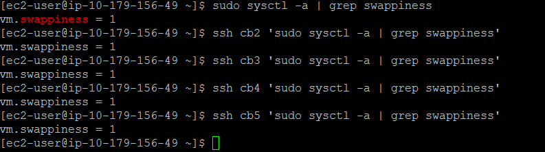
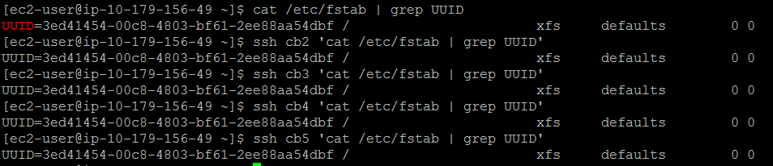
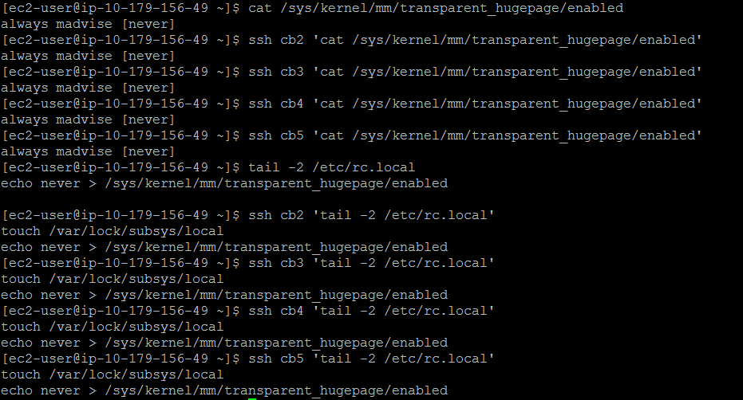
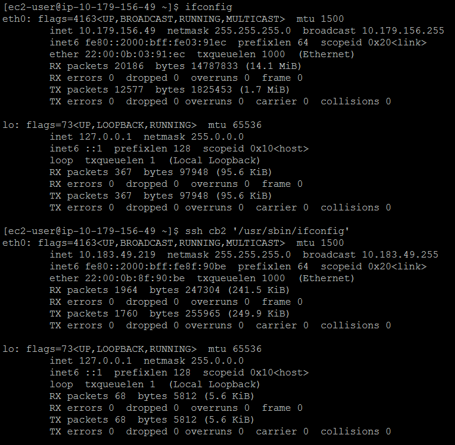
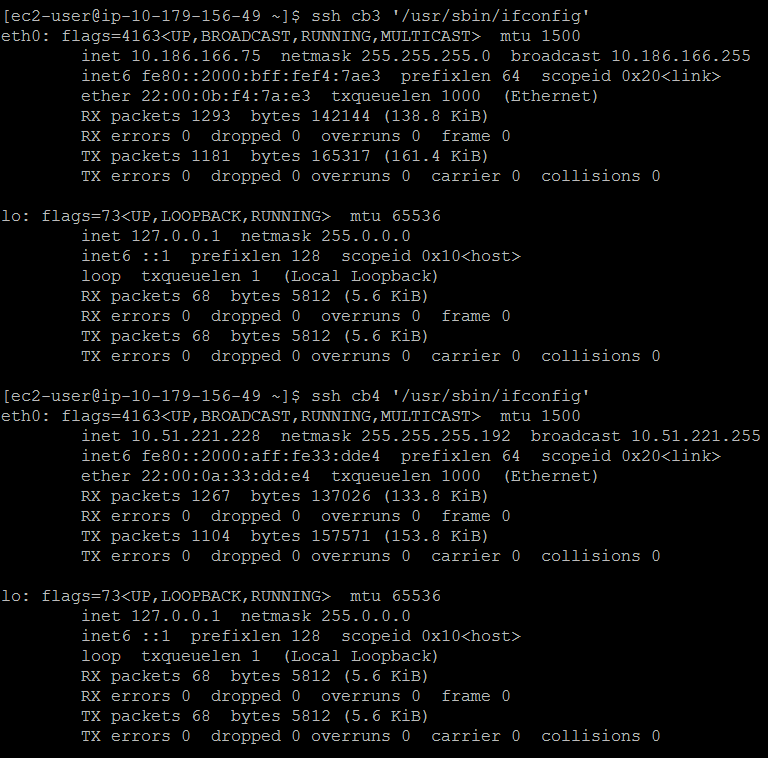
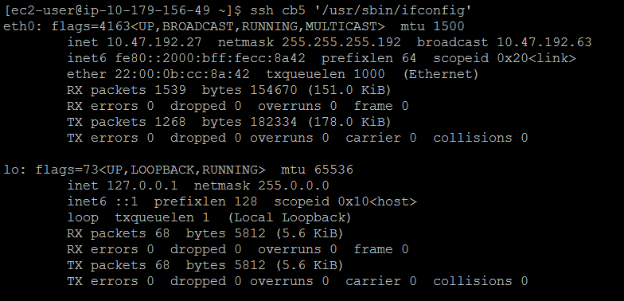
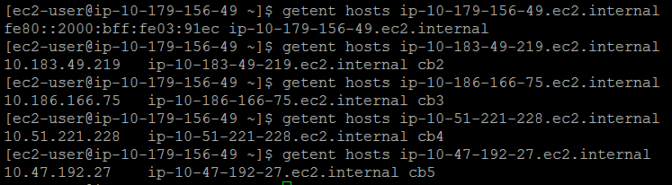
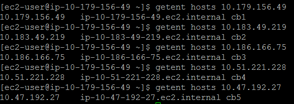
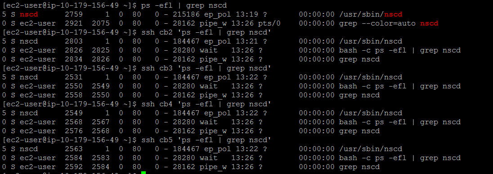

# 1. System Configuration Checks

## 1. Swappiness
* set to 1

## 1. Mounts

1. Disable THP
* set to never
* set even after reboots

1. Network interface configuration

1. Forward and reverse host lookups
* forward

* reverse

1. nscd service running

1. ntpd service running

