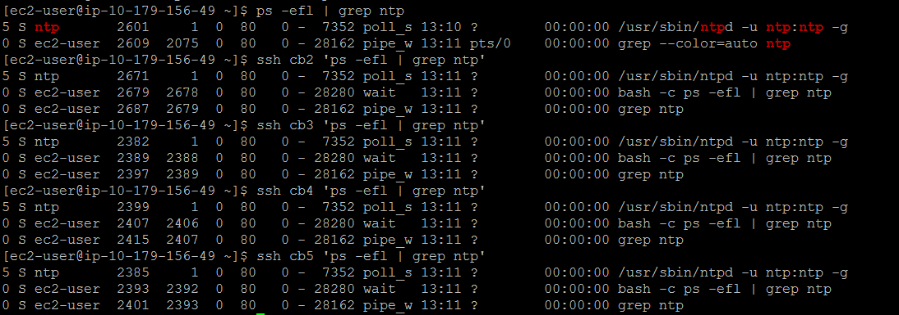

# 1. System Configuration Checks

## Swappiness
### * set to 1

## Mounts

## Disable THP
### * set to never
### * set even after reboots

## Network interface configuration

## Forward and reverse host lookups
### * forward

### * reverse

## nscd service running

## ntpd service running

