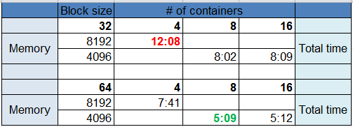

## Slowest run 
### Teragen
`time hadoop jar /opt/cloudera/parcels/CDH/lib/hadoop-0.20-mapreduce/hadoop-examples.jar teragen -Ddfs.blocksize=32M -Ddfs.replication=1 -Dio.file.buffer.size=131072 -Dmapreduce.job.maps=4 -Dmapreduce.map.cpu.vcores=1 -Dmapreduce.map.java.opts=-Xmx9830m -Dmapreduce.map.memory.mb=8192 -Dmapreduce.task.io.sort.mb=256 -Dyarn.app.mapreduce.am.resource.mb=1024 107374182 hdfs://hdfsdsemcha/user/dougspadottoemc/terasort-in
`
### Terasort
`time hadoop jar /opt/cloudera/parcels/CDH/lib/hadoop-0.20-mapreduce/hadoop-examples.jar terasort -Ddfs.blocksize=32M -Dio.file.buffer.size=131072 -Dmapreduce.map.java.opts=-Xmx9830m -Dmapreduce.map.memory.mb=8192 -Dmapreduce.task.io.sort.factor=100 -Dmapreduce.task.io.sort.mb=768 -Dmapreduce.job.reduces=4 -Dmapreduce.reduce.cpu.vcores=1 -Dmapreduce.reduce.java.opts=-Xmx9830m -Dmapreduce.reduce.memory.mb=8192 -Dmapreduce.terasort.output.replication=1 -Dyarn.app.mapreduce.am.resource.mb=1024 hdfs://hdfsdsemcha/user/dougspadottoemc/terasort-in hdfs://hdfsdsemcha/user/dougspadottoemc/terasort-out
`
### Total run time: 12m08s

## Fastest run
### Teragen
`time hadoop jar /opt/cloudera/parcels/CDH/lib/hadoop-0.20-mapreduce/hadoop-examples.jar teragen -Ddfs.blocksize=64M -Ddfs.replication=1 -Dio.file.buffer.size=131072 -Dmapreduce.job.maps=8 -Dmapreduce.map.cpu.vcores=1 -Dmapreduce.map.java.opts=-Xmx4915m -Dmapreduce.map.memory.mb=4096 -Dmapreduce.task.io.sort.mb=256 -Dyarn.app.mapreduce.am.resource.mb=1024 107374182 hdfs://hdfsdsemcha/user/dougspadottoemc/terasort-in
`

### Terasort
`time hadoop jar /opt/cloudera/parcels/CDH/lib/hadoop-0.20-mapreduce/hadoop-examples.jar terasort -Ddfs.blocksize=64M -Dio.file.buffer.size=131072 -Dmapreduce.map.java.opts=-Xmx4915m -Dmapreduce.map.memory.mb=4096 -Dmapreduce.task.io.sort.factor=100 -Dmapreduce.task.io.sort.mb=768 -Dmapreduce.job.reduces=8 -Dmapreduce.reduce.cpu.vcores=1 -Dmapreduce.reduce.java.opts=-Xmx4915m -Dmapreduce.reduce.memory.mb=4096 -Dmapreduce.terasort.output.replication=1 -Dyarn.app.mapreduce.am.resource.mb=1024 hdfs://hdfsdsemcha/user/dougspadottoemc/terasort-in hdfs://hdfsdsemcha/user/dougspadottoemc/terasort-out
`
### Total run time: 05m09s 

### All runs
