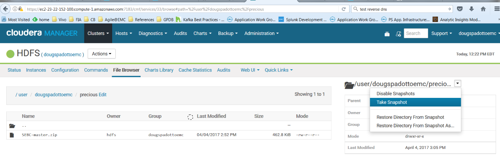

```
[ec2-user@ip-10-179-156-49 ~]$ hadoop fs -ls precious
Found 1 items
-rw-r--r--   3 hdfs dougspadottoemc     473950 2017-04-04 14:52 precious/SEBC-master.zip
```

### Took snapshot using Cloudera Manager


### Making sure it's snapshottable
```
[ec2-user@ip-10-179-156-49 ~]$ hdfs lsSnapshottableDir
drwxr-xr-x 0 dougspadottoemc dougspadottoemc 0 2017-04-04 15:05 1 65536 /user/dougspadottoemc/precious
```

### Deleting the file
```
[ec2-user@ip-10-179-156-49 ~]$ hdfs dfs -rm -r /user/dougspadottoemc/precious/SEBC-master.zip
17/04/06 12:29:01 INFO fs.TrashPolicyDefault: Moved: 'hdfs://hdfsdsemcha/user/dougspadottoemc/precious/SEBC-master.zip' to trash at: hdfs://hdfsdsemcha/user/dougspadottoemc/.Trash/Current/user/dougspadottoemc/precious/SEBC-master.zip 
```

### Certifying the file is gone, recovering from snapshot and certifying that
```
[ec2-user@ip-10-179-156-49 ~]$ hdfs dfs -ls /user/dougspadottoemc/precious
[ec2-user@ip-10-179-156-49 ~]$ hdfs dfs -cp /user/dougspadottoemc/precious/.snapshot/sebc-hdfs-test/SEBC-master.zip /user/dougspadottoemc/precious
[ec2-user@ip-10-179-156-49 ~]$ hdfs dfs -ls /user/dougspadottoemc/precious
Found 1 items
-rw-r--r--   3 dougspadottoemc dougspadottoemc     473950 2017-04-06 12:32 /user/dougspadottoemc/precious/SEBC-master.zip
```

Disclaimer: I've uploaded this file on Thursday while reviewing the material to be delivered, you'll notice this from the files' dates